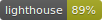
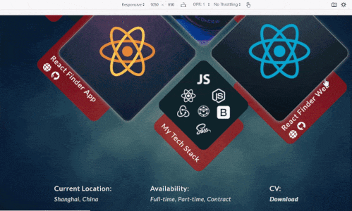

</img>

<h1 align="center">Andrei Zernov</h1>
<h1 align="center">My Professional Portfolio</h1>

  

---

<h2 align="center">Technologies</h2>

Project is created with:

<ul>
  <li>React: 16.13.0</li>
  <li>SASS: 4.13.1</li>
  <li>Bootstrap: 4.4.1</li>
  <li>react-lottie: 1.2.3</li>
</ul>

---

<h2 align="center"> Launch and Content</h2>

To launch this project, go to https://andreizernov.netlify.app/

<h3 align="center"> 1. React Finder Web </h3>

Application created for community as links to Free Helpful Resources, which cover React, React Native, Redux and GraphQl materials. This is React Web Application with the integration of React Context and Hooks, Auth0 Authentication with fast Github and Google Login, QraphQl (all data published and managed at Contentful), Bootstrap component library, Formspree form backend email service, Lottie Animations.

  
  
  

<h3 align="center">Multik Collection</h3>

Gallery of Projects and Photo Collection for Professional Photographer MLTK, React Progressive Web Application with the integration of React Context and Hooks, SASS, QraphQl, Bootstrap component library, Animation with ScrollMagic and GSAP libraries.

  
  
  

<h3 align="center">React Finder App</h3>

This is React Native Application with the integration of Redux, Firebase Authentication, QraphQl (all data published and managed at Contentful), Styled Components, Lottie Animations. Project fully ready for IOS, Android deployment. Responsive Design for Tablets and Phones. Published at Expo Store. Application created for community as links to Free Helpful Resources, which cover React, React Native, Redux and GraphQl materials.

<h3 align="center">Responsive Design</h3>

  

---

<h2> Support</h2>

Reach out to me at one of the following places!

Website at [Andrei Zernov](https://andreizernov.netlify.app/)

Twitter at [AndrewZ](https://twitter.com/AndrewZer)

LinkedIn at [Andrei Zernov](https://www.linkedin.com/in/andrei-zernov/)

---

<h2> License</h2>

MIT license 

Copyright 2020 © Andrei Zernov

